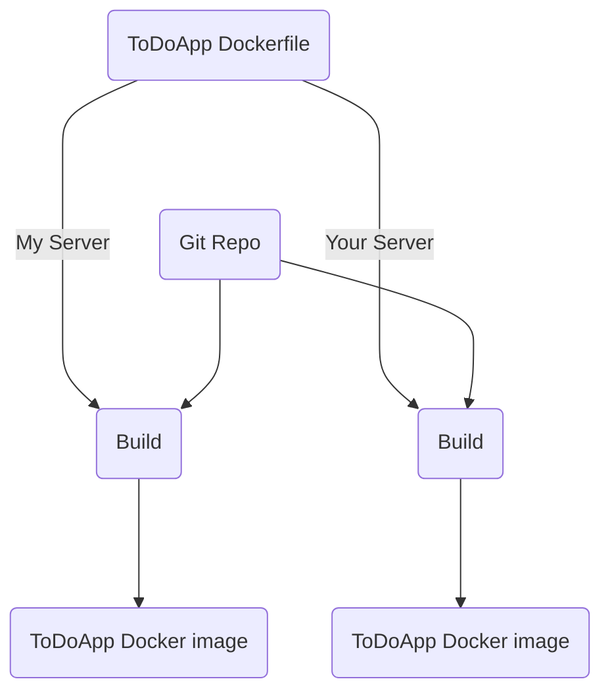

# Chapter-1 

### What is docker and docker images?
    - Docker is a software platform that allows you to build, test, and deploy applications quickly. Docker packages software into standardized units called containers that have everything the software needs to run including libraries, system tools, code, and runtime

    - Containers are running systems defined by images

    - An image is a collection of filesystem layers and some metadata. Taken combine togrther is known as Docker containers.

    - Containers are created from images inherit their filesystems, and use their metadata to determine their startup configurations

### TO-DO Dockerfile

